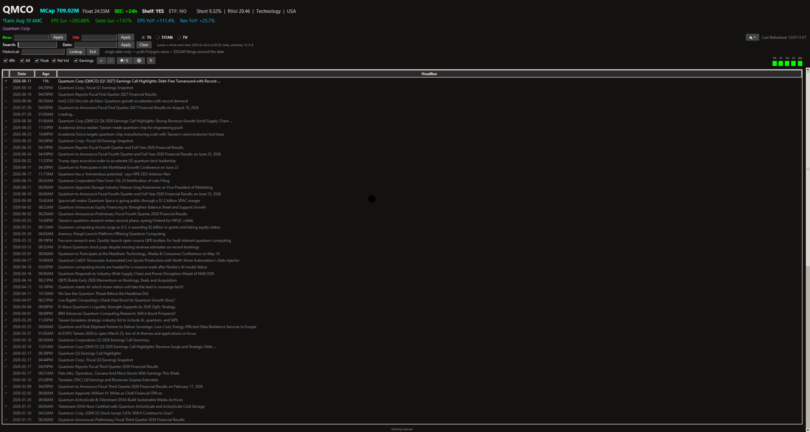

# Morning Scanner

  

A real-time news, SEC filing, and earnings scanner for active traders on Windows. Morning Scanner floats above your charting platform, automatically detects which ticker you're viewing, and pulls up relevant news headlines, SEC filing activity, float and short data, earnings proximity, and more — switching automatically as you change symbols.



A **single unified script** — [`scan_sec.py`](scan_sec.py) — supports three trading platforms. Switch between them with the **TS / TITAN / TV** radio buttons; the active mode persists across sessions.

| Mode | Platform | Symbol Detection |
| --- | --- | --- |
| **TS** | TradeStation (classic desktop) | `win32gui` — parses Market Depth / Matrix child-window titles |
| **TITAN** | TradeStation TITAN X (Electron) | UI Automation (`comtypes`) — TreeWalker + FindAll fallback |
| **TV** | TradingView Desktop (Electron) | `win32gui` — `Chrome_WidgetWin_1`, symbol + price triangle |

The window watcher runs on a dedicated daemon thread with a stall watchdog, so a hung platform call can't freeze the UI.

---

## Features

- **Automatic symbol detection** — reads the active ticker from your trading-platform window in real time; no manual input. Polls continuously with a short debounce.
- **News aggregation** — combines headlines from Finviz, PRNewswire, Stocktitan, and Yahoo Finance into a single chronological feed (RSS, refreshed on a timer). Each wire has its own status dot, and a feed whose origin goes dark is automatically taken out of rotation rather than being allowed to slow the healthy ones down (see [Wire resilience](#wire-resilience)).
- **SEC filing awareness** — uses the modern `data.sec.gov/submissions` JSON API for all SEC lookups:
  - **Recency indicator** — color-coded by whether the company filed anything in the last 24 h (hot), 48 h (warm), or longer (cold). Click to open EDGAR.
  - **Shelf registration** — flags active S-3 filings. Click to view on EDGAR.
  - **Unknown ≠ negative** — when SEC can't be reached, or no CIK resolves for the symbol, both indicators show an em-dash (`Shelf: —`, `SEC: —`) rather than asserting `Shelf: NO`. A transient SEC error is retried on the next symbol change instead of being remembered for the session.
- **CIK resolution** — maps tickers to SEC CIK numbers via the official `sec.gov/files/company_tickers.json` endpoint with fuzzy name-matching fallback; cached locally.
- **Market cap** — always shown in the header in a large font, optionally colored by a 5-tier stepped gradient (micro / small / mid / large / mega, bright-red → bright-green). The gradient toggle and all five tier colors are tunable in **Settings → Market Cap**.
- **Float & short data** — shares float (toggleable via the **Float** checkbox, optionally colored by a low-float cutoff) and short-float percentage from Finviz. The cutoff, the low/high colors, and the coloration on/off toggle are tunable in **Settings → Float**.
- **Earnings row** — earnings date, EPS surprise, sales surprise, and EPS / revenue YoY on a dedicated togglable row, color-coded by proximity, with a future-date suppression safeguard.
- **Earnings chart** — double-click any earnings label to open a per-quarter chart (YoY % and Surprise % bars on outlier-robust axes, click-to-highlight a quarter, live color editor). The chart shows a configurable history window — 5 years by default — and can draw that window at a **fixed** width so bars stay the same size on every ticker (see [Earnings chart history window](#earnings-chart-history-window)). Reads an optional earnings-history parquet you supply (see [Optional earnings data](#optional-earnings-data)).
- **Historical Lookup** — surfaces news and SEC EDGAR filings around any date for the active symbol, with async one-line summaries for filing rows. It draws on three sources: your cached wires (all live feeds, ~7 days back), SEC EDGAR full-text search (years), and optionally Polygon (see [API keys](#api-keys--privacy)). Note that RSS wires are *current-news* formats with no archive — a Stocktitan pull spans roughly 4 hours — so for dates older than the wire cache's 7-day window, EDGAR and Polygon are what reach back.
- **ETF coverage** — two indicators driven by JSON maps you can refresh from Settings:
  - **Single-stock ETF** — flags any active symbol covered by a leveraged / inverse single-stock ETF (and, when the symbol *is* one, what it tracks).
  - **Multi-holding ETFs** — a second **Held: N** indicator counts the sector / index / thematic / leveraged-index ETFs that hold the active stock as a top holding (click for the list). When the active symbol *is* one of those ETFs, the indicator turns blue with a high-confidence sector/strategy + leverage label (e.g. `ETF: Tech`, `ETF: 3X`), and hovering lists its current constituents. Holdings are sourced from [stockanalysis.com](https://stockanalysis.com); swap-based leveraged/inverse funds have their constituents recovered from the swap descriptions (via SEC name→ticker matching), falling back to a leverage-only badge when they can't be resolved.
- **Link indicator** — a small **↗** in a narrow gutter on the left marks every row that double-click will actually open, in both the news list and Historical Lookup. Rows without one (the historical banner, error notices, a scraped item whose link was missing) are text-only, so you never double-click into nothing. The marker mirrors the URL allowlist exactly, so it can't promise a click the app would then refuse.
- **Quality-of-life** — keyword highlighting, time filters (Today / 48 h / All), live per-source status dots, clickable headlines, dark / light theme, adjustable font size, always-on-top, and persistent settings. Window position is restored on launch and re-centred automatically if the monitor it was saved on is no longer attached. The running version is shown in the window title.

## Wire resilience

News origins fail in a way that's easy to miss: they accept the connection and then simply never answer. One such feed used to cost the app three retries × the request timeout on *every* cycle — and because a cycle waits for its slowest feed, that delayed the healthy wires and blocked every manual refresh by the same amount.

- **A dark origin is taken out of rotation.** After a few consecutive failures the feed is skipped entirely and re-probed once (single attempt) every ~10 minutes. A successful probe closes the circuit immediately, so recovery is automatic — no restart.
- **`429` is treated as an instruction, not a failure.** A rate-limited origin trips the breaker on the *first* response and is left alone for exactly the `Retry-After` it asked for. Retrying through a 429 only restarts the limiter's window.
- **Per-feed poll floors.** Origins rate-limit at very different rates, so each feed carries its own minimum interval. Stocktitan is polled every 5 minutes rather than every 60 seconds; its pulls are ~100 items deep, so nothing is missed.
- **Short timeouts.** Every healthy feed answers in well under a second, so the request timeout is 6 s — a longer one only buys latency when an origin goes dark.

Net effect: one dead source costs you one grey/red dot, not slower news everywhere.

> **Note on GlobeNewswire:** it was replaced by Stocktitan on 2026-08-11. Its edge began completing the TLS handshake and then never responding — every path on the host, including the homepage, read-timed-out, and a VPN made no difference. Stocktitan also carries a ticker in ~94% of its headlines (vs ~37% for the other wires), which is what the per-symbol news filter matches on.

## Earnings chart history window

A deep-history ticker charts 100+ quarters, which squeezes the bars you actually care about down to slivers. The pop-out therefore draws a bounded window, set in **Settings → Earnings chart**:

- **History window (years)** — how far back to draw, **5 years (20 quarters) by default**. The window is anchored on the newest column and counts backwards, and an upcoming earnings date counts as one of those quarters, so the chart stays pinned to the present rather than drifting with the parquet's age. `0` means **All** — no limit, the original behavior.
- **Bars: Adaptive / Fixed** — *adaptive* draws only the quarters that exist, so a thin-history ticker stretches its bars across the panel. *Fixed* always draws the full window, padding the missing older quarters as blank dated slots, so bar width and column count are identical on every ticker and two charts can be read side by side.

A padded slot is deliberately **not** the same thing as a missing quarter: quarters the app knows about but has no data for render `??`, while padding older than the ticker's history is simply blank. The window applies to Historical Lookup charts too — and if the date you looked up is older than the window, the window is extended back to reach it rather than trimming away the quarter you were looking for.

## Data integrity

This is a trading tool, so the design bias throughout is **show nothing rather than show something wrong**:

- **Quarters are never mixed.** The earnings row decides which quarter it is showing by whether the local parquet row and the live Finviz date describe the *same reporting event*, not by assuming consecutive quarters are far apart. A quarter the parquet hasn't ingested yet shows its own date and surprises with YoY left blank (then backfilled asynchronously) — it never borrows the previous quarter's YoY, period, or surprise.
- **Rows that can't be true are discarded.** A parquet row whose fiscal period ends *after* the date it was reported is dropped rather than displayed, and genuine duplicates are resolved by report-lag plausibility and source preference rather than by file order.
- **The chart shows the ticker in its title.** The earnings pop-out snapshots its symbol, CIK, and metadata when you open it, so changing charts mid-load can never merge another company's figures into it; a load whose symbol went stale is discarded.
- **A bad data file degrades, it doesn't break.** The optional earnings parquet is validated and type-normalized once when loaded; a renamed column or a drifted dtype leaves the earnings row blank instead of silently stopping the news list from updating.
- **Non-finite values never render.** `nan` / `inf` reaching a percentage or market-cap cell is treated as no-data rather than formatted as a magnitude.

## Requirements

- **Windows only** — all editions use Windows APIs for symbol detection.
- **Python 3.10+** — built and validated on **3.10.11**; `requirements.txt` pins the exact build environment.

```bash
pip install -r requirements.txt
```

The default **TS** and **TV** modes need only `pywin32`. The **TITAN** mode additionally requires `comtypes` (UI Automation). `rapidfuzz` is optional — the code falls back to the stdlib `difflib` for CIK name-matching when it's absent.

A headless smoketest covers construction/teardown, settings persistence, the URL allowlist, the EDGAR regex gates, and the data-integrity guarantees above:

```bash
venv\Scripts\python.exe _smoketest.py    # exit 0 = all green
```

## Usage

1. Open your trading platform with a chart or Market Depth / quote window visible.
2. Run the scanner:

   ```bash
   python scan_sec.py
   ```

3. Pick your platform with the **TS / TITAN / TV** radio buttons.
4. The scanner detects the active ticker and loads news, SEC data, earnings, and market metadata. Switch symbols in your platform and the scanner follows automatically.

### Controls

| Control | Action |
| --- | --- |
| **48h** / **All** checkboxes | Widen the news window to the last 48 hours / show all cached headlines |
| **Float** checkbox | Show the shares-float value in the header (market cap is always shown) |
| **Rel Vol** checkbox | Show relative volume in the metadata bar |
| **Earnings** checkbox | Show the earnings row (date, EPS / sales surprise, YoY) |
| **Highlight** field | Comma-separated keywords to highlight in the news table |
| **+** / **−** buttons | Increase / decrease font size |
| Theme button | Toggle dark / light |
| Double-click headline | Open the article in your browser (rows marked **↗** are clickable) |
| Double-click an earnings label | Open the per-quarter earnings chart |
| Click company name | Open the Finviz quote page |
| Click **SEC:** / **Shelf:** labels | Open EDGAR recent filings / S-3 filings |
| Click **ETF:** label | Single-stock ETF → Finviz for the underlying; multi-holding ETF → constituents popup |
| Hover **ETF:** label (when symbol is an ETF) | Tooltip of the ETF's current constituents |
| Click **Held: N** label | List of multi-holding ETFs that hold the active stock |

## API keys & privacy

- **Polygon (optional)** — Historical Lookup news enrichment can use the Polygon API. The key is stored in the **Windows Credential Manager** via `keyring` (never written to disk, never logged) and sent as an `Authorization: Bearer` header. Set / clear it from the Settings dialog. Without it, Historical Lookup still works from EDGAR.
- **SEC contact** — SEC fair-access guidance asks for a declared contact in the `User-Agent`. Set it in the **Settings dialog** (*SEC access → Contact email*) — it's saved with your other settings and applied live. The `MS_SEC_CONTACT` environment variable is still honored as a fallback when the Settings field is blank. If neither is set, a non-deliverable placeholder is used and SEC may throttle requests. No contact email is hardcoded in the source.

## Optional earnings data

The earnings YoY columns and the double-click earnings chart read an optional `earnings_history.parquet` produced by your own earnings-data pipeline (per-quarter EPS / revenue actuals, surprises, and YoY). Point the scanner at your file via **Settings**; by default it looks for `earnings_history.parquet` next to the app. Missing fields are gap-filled live from SEC EDGAR XBRL company-facts and from Finviz for the most-recent quarter. **The scanner runs fine without the parquet** — those fields simply stay empty.

## Building a standalone executable

A PyInstaller spec is included:

```bash
pip install pyinstaller
pyinstaller TNS.spec
```

This bundles Tcl/Tk, the `single_stock_etfs.json` + `etf_holdings.json` seeds, and the keyring/pyarrow/matplotlib backends. TITAN (UIA) mode additionally requires `comtypes` to be installed in the build environment and listed in the spec's `hiddenimports`.

## Data sources

| Source | Provides |
| --- | --- |
| [Finviz](https://finviz.com) | Company name, float, short interest, market cap, relative volume, earnings date, EPS / sales surprise, catalyst text |
| [SEC EDGAR](https://data.sec.gov) | CIK mapping, filing recency, S-3 shelf registration, XBRL company-facts (via the `submissions` / `companyfacts` JSON APIs) |
| [PRNewswire](https://www.prnewswire.com) · [Stocktitan](https://www.stocktitan.net) · [Yahoo Finance](https://finance.yahoo.com) | Press-release and market-news headlines (RSS) |
| [Polygon](https://polygon.io) | Optional historical news for the Historical Lookup |
| [stockanalysis.com](https://stockanalysis.com) | Multi-holding ETF holdings, sector mix, and category for the ETF indicators (refreshed from Settings) |

## Limitations

- **Windows only** — requires `pywin32` (TS / TV) or `comtypes` + UI Automation (TITAN).
- **Web-scraping fragility** — Finviz data is extracted from HTML; site redesigns can break extraction. The status dots show `ERR` when a source fails.
- **Rate limiting** — outbound requests are throttled (Finviz and SEC have fair-access limits). Rapid symbol switching may briefly delay data.
- **Not a price feed** — this is a news / filing / earnings scanner, not a real-time quote source.

---

## Disclaimer

**This software is provided for educational and informational purposes only. It is not financial advice, and nothing in this application constitutes a recommendation to buy, sell, or hold any security.**

- All displayed data (news, SEC filings, float, short interest, earnings, surprise figures) is sourced from public providers and may be delayed, incomplete, or inaccurate.
- SEC filing detection uses the `data.sec.gov` API and **is not guaranteed to be accurate or complete**. Always verify filings directly on [EDGAR](https://www.sec.gov/edgar/searchedgar/companysearch).
- The authors and contributors accept **no liability** for any trading losses, errors, or damages arising from use of this tool. **Use at your own risk** — you are solely responsible for your own trading decisions.

## License

[MIT](LICENSE) © 2026 Troy Folmer
